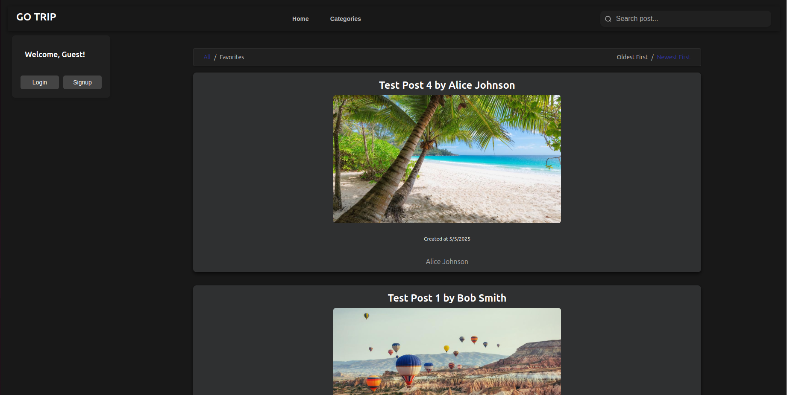
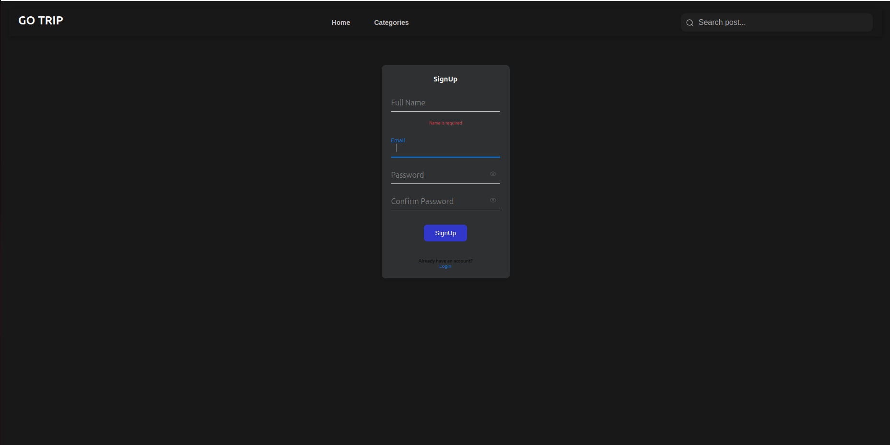
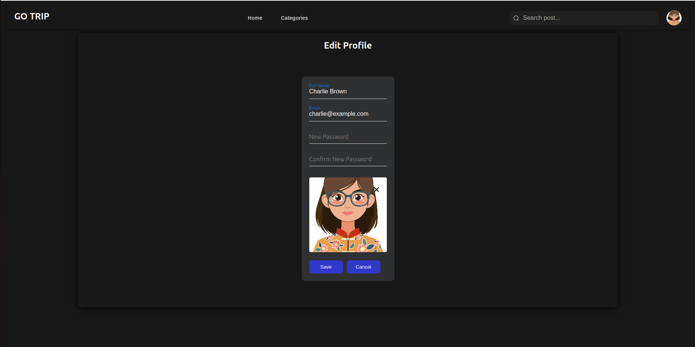
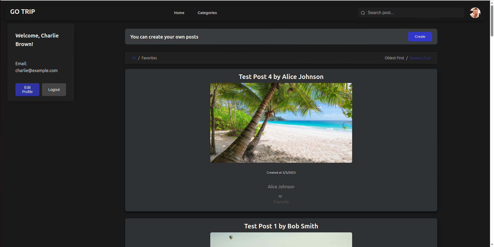
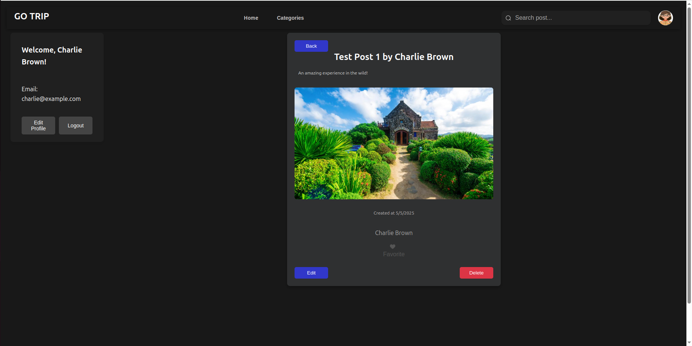
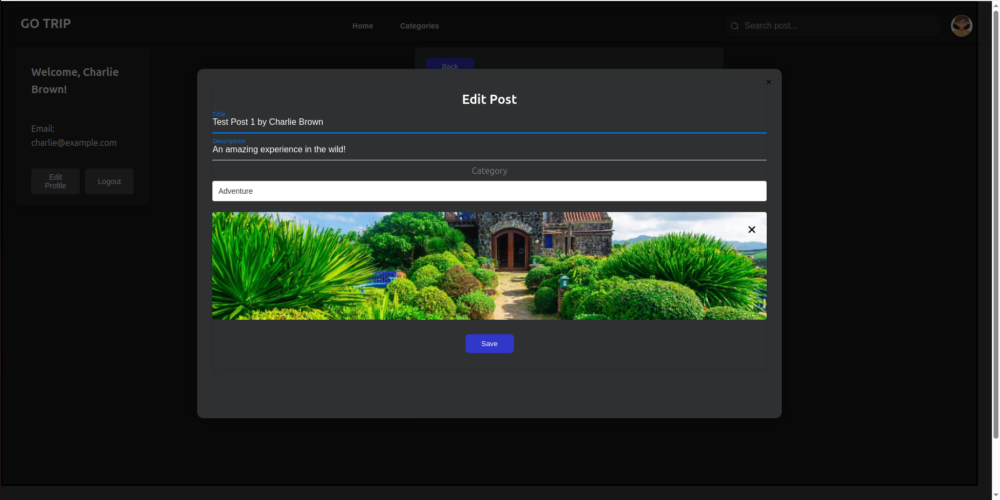

<pre style="white-space: pre-wrap;">

🌍 GoTrip

GoTrip is a modern travel-themed social media app where users can explore, share, and discover travel experiences around the world. Built with a modular React architecture, GoTrip includes user authentication, post feeds, favorites, and category filtering.

Features

. Authentication (Login & Signup with full validation)
. Explore Posts from other travelers
. Create & Edit Posts (title, description, image)
. Favorite Posts you like
. Search & Sort posts by time or interest
. Edit Profile (name, password, email?(need review), avatar)
. Clean, dark-themed UI

Guest View

    Here's what the main feed looks like for a guest user:

 
    

    
 Signup Validation

The signup page includes full client-side validation, ensuring:
. Valid email format
. Password strength requirements
. Matching password confirmation
. This helps ensure data integrity and improve user experience.

 
    

User Profile Management
    
Once authenticated, users can:

Edit their profile information, including:
Name, Email, Password (with proper validation), Avatar image

  
    
    
Logged-In View
  
    Authenticated users see their info and can post, favorite, and edit their profiles.
    
    
    
    
After logging in, users can:
. View their email and profile
. Create their own posts
. Favorite others' posts

 
    

Also, after logging in, users can:
. Delete post
. Edit post

    
    

Post Editing
Authenticated users can:
Edit their own posts, including:
Title, Description, Image

  
    
    
Project Structure

goTrip/
└── src/
    ├── assets/
    │   ├── images/
    │   └── svgs/
    ├── components/
    │   ├── App/
    │   ├── common/
    │   ├── features/
    │   │   ├── Auth/
    │   │   ├── Feed/
    │   │   ├── Profile/
    │   │   └── NotFound/
    │   └── layouts/
    ├── hooks/
    │   └── useScrollPosition.js
    ├── routes/
    │   └── configureRouter.js
    ├── services/
    │   ├── authSrevice.js
    │   ├── favoriteSrevice.js
    │   ├── postSrevice.js
    │   ├── storageSrevice.js
    │   └── userSrevice.js
    ├── store/
    │   ├── middlewares/
    │   │   └── asyncFunctionMiddleware.js
    │   ├── modules/
    │   │   ├── authSlice.js
    │   │   └── postSlice.js
    │   └── configureStore.js
    └──package.json

    Tech Stack

React
Redux Toolkit
React Router
Custom Hooks
Local Storage

    Getting Started

git clone https://github.com/mkr-sof/Go-Trip.git
cd goTrip
npm install
npm run dev

    
Feel free to fork the repo, open issues, or contribute!
</pre>
